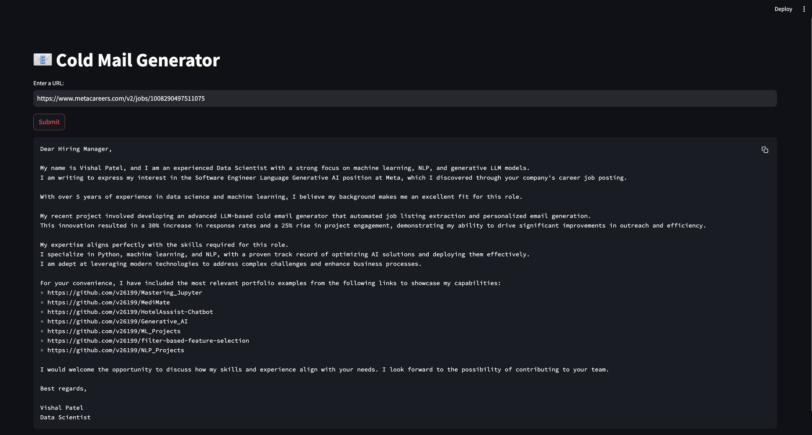

# AI-Powered Cold Email Generator: Supercharge Your Outreach!

## Overview

Transform your outreach game with our cutting-edge AI-powered cold email generator! Built for Maggen Technology, this tool harnesses the magic of the latest LLMs (Large Language Models) like LLAMA-3 and Groqcloud to craft ultra-personalized, high-impact cold emails in a flash.

## How It Works
1. Scrape & Gather: Automatically extract job postings using the Langchain framework.
2. Smart Parsing: Turn job requirements into structured JSON with LLAMA-3’s advanced parsing.
3. Top Picks: Match job specs to your portfolio with Chromadb’s smart similarity search.
4. Craft & Shine: Generate tailored cold emails that hit the mark every time.
5. Send & Win: Dispatch your perfectly polished emails directly to hiring teams or clients.

## Example in Action

Picture Meta hunting for a Machine Learning Engineer. Here’s how our tool makes a splash:

- Scrape: Pulls Meta’s job details effortlessly.
- Match: Links job needs to your standout portfolio projects.
- Create: Whips up a compelling, personalized email.
- Send: Sends it straight to Meta’s HR, boosting your chances of landing that dream role!

## Why You’ll Love It
#### For marketing teams, this tool is a game-changer:

- Laser Precision: Tailors every email to exactly what your client needs.
- Time Saver: Automates email crafting, freeing up your time for other important tasks.
- Boosted Engagement: Increases responses with emails that resonate.
- Professional Polish: Ensures every email is sleek and professional.

## Architecture Diagram

## Working process..

## Getting Started

1. Grab Your API Key: Sign up at [Groqcloud Console](https://console.groq.com/keys) and pop your API key into `app/.env`.
2. Install Dependencies: Run `pip install -r requirements.txt`.
3. Launch: Start the app with `streamlit run app/main.py` and watch the magic happen!

## License

MIT License. Commercial use requires permission. Please give attribution for any substantial use.

